🚀 Deploy Web Application Using Python Flask & Docker

📌 Project Idea

This project demonstrates how to build and deploy a simple Python Flask web application inside a Docker container.
It shows how to containerize a Flask app, run it using Docker Compose, and verify the deployment with screenshots.
The project is suitable for beginners learning Docker, Flask, and basic DevOps concepts, and it can be easily deployed on AWS EC2 or any Linux server.

---

📂 Project Structure

app.py → Main Flask application file.

requirements.txt → Python dependencies required for the Flask app.

Dockerfile → Instructions for building the Docker image.

docker-compose.yaml → Configuration to run the Flask app using Docker Compose.

screenshot/ → Step-by-step visual documentation of the project.

---

🛠 How It Works

1. Create a simple Flask web application in app.py.

2. Define the required Python libraries inside requirements.txt.

3. Use a Dockerfile to build a Docker image for the Flask application.

4. Run the application using Docker Compose and expose it on port 5000.

5. Access the web application through a browser using http://localhost:5000.

6. Any update to the application can be re-deployed by rebuilding the container.

> Note: The Flask application code is located in (app.py).

---

📸 Screenshots

### 1️⃣ Project Code
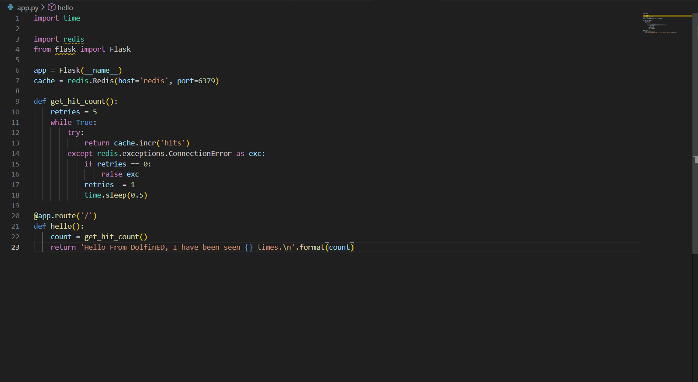  
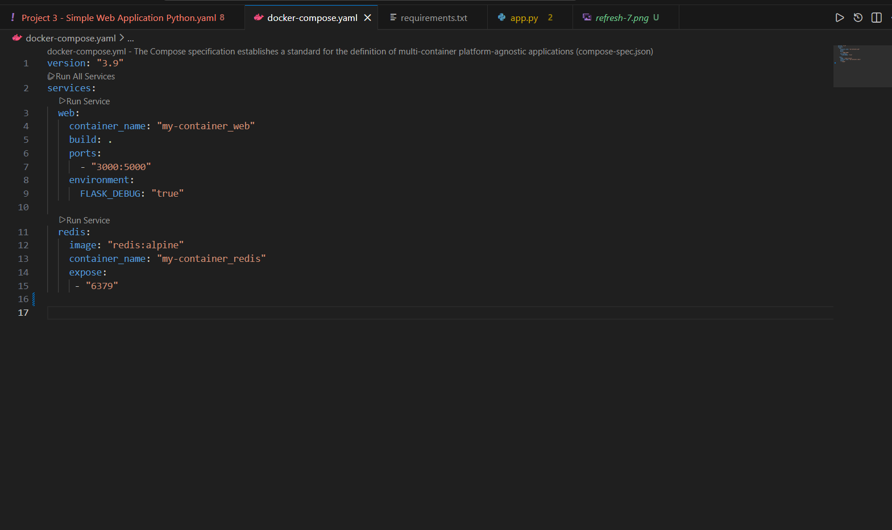  
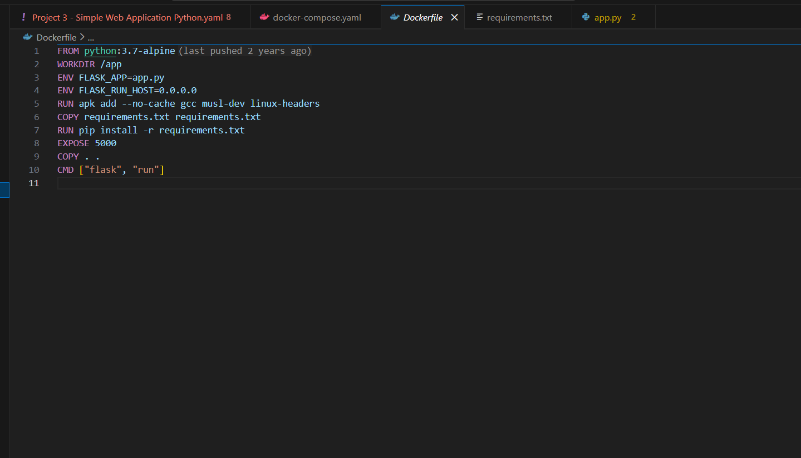  
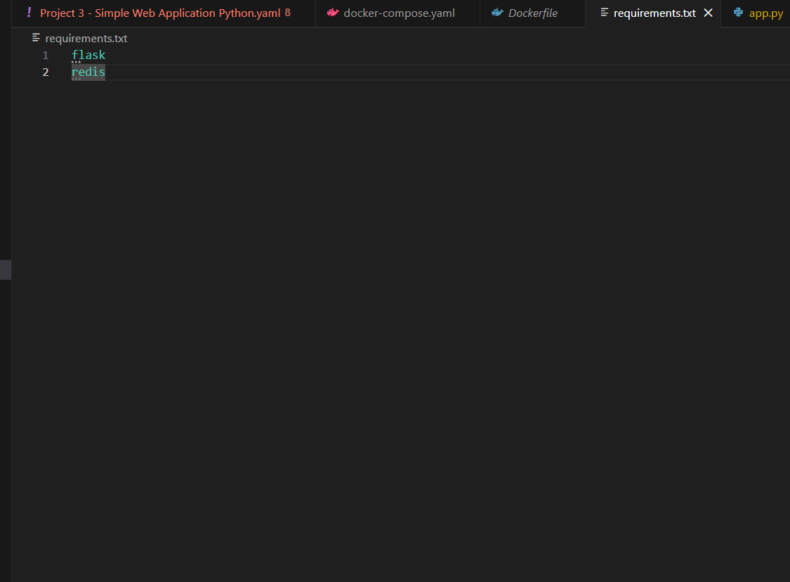  

Shows the Flask application files and Docker configuration.

---

2️⃣ Building & Running the Container

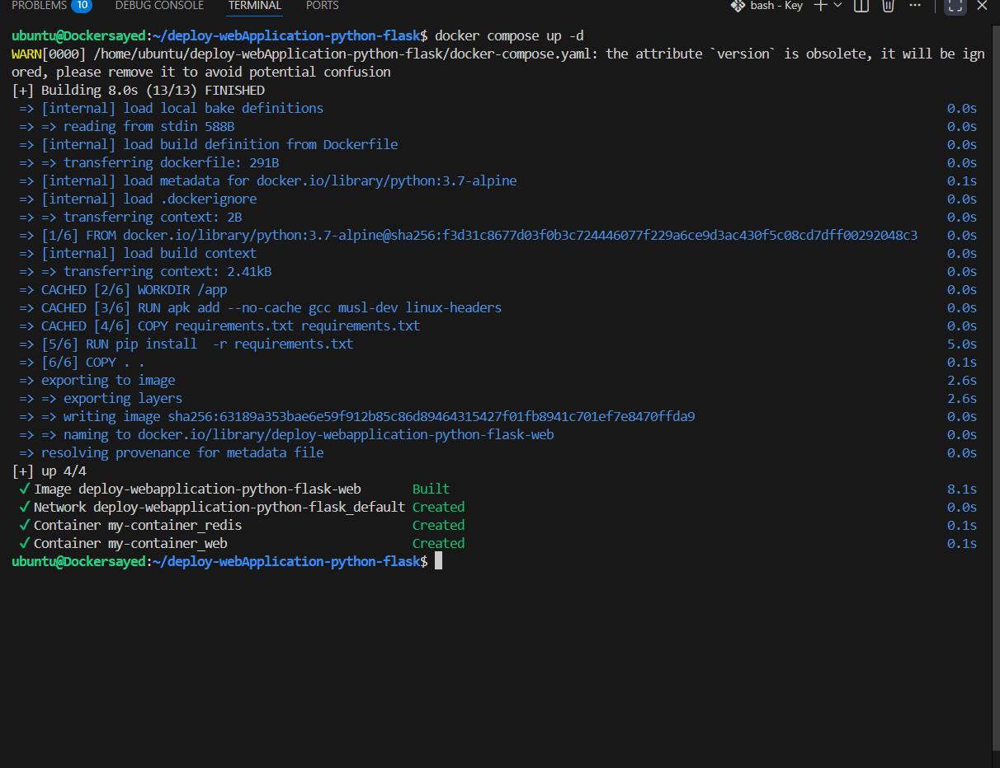  
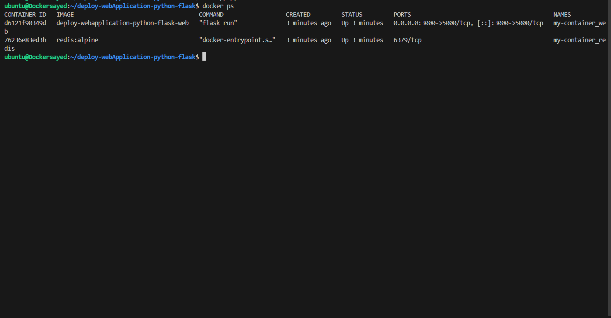  

Docker image build and container running successfully.
---

3️⃣ Application Running in Browser
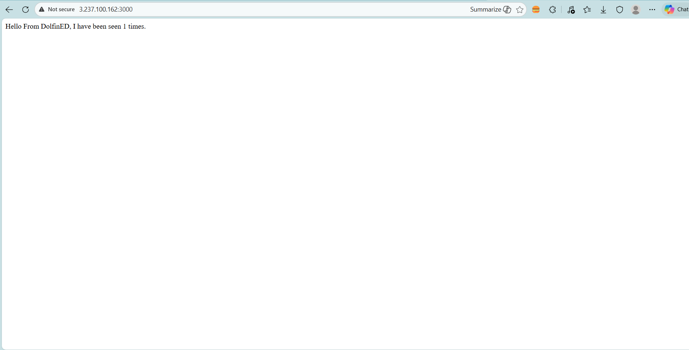  
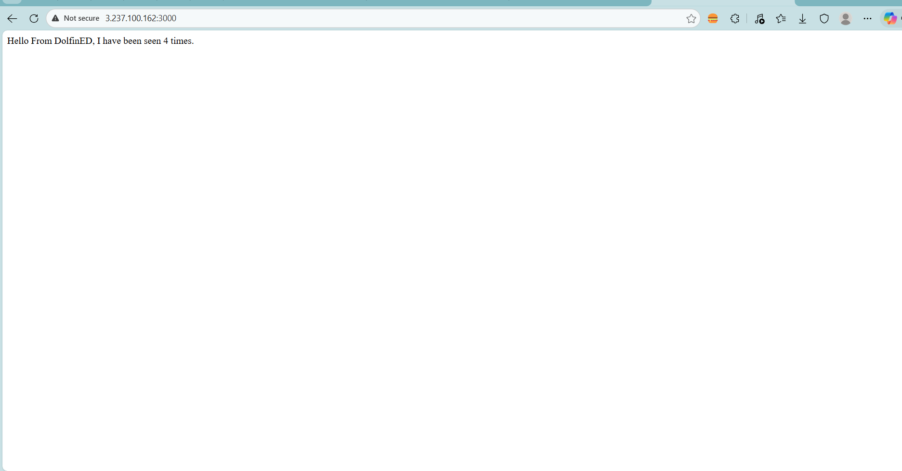  
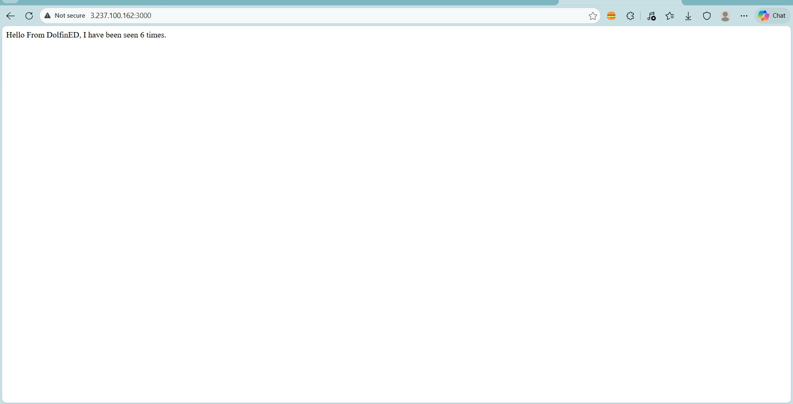  
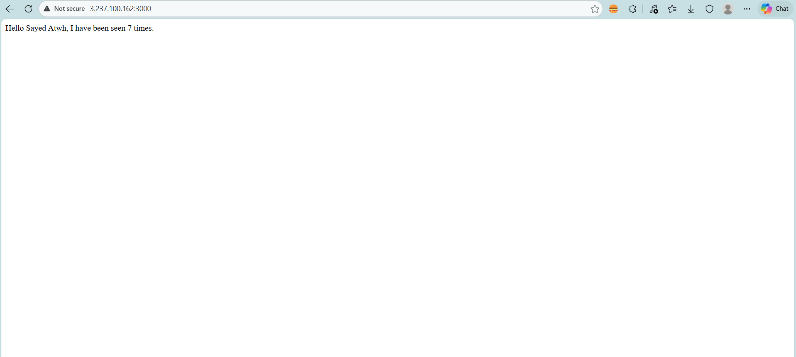  
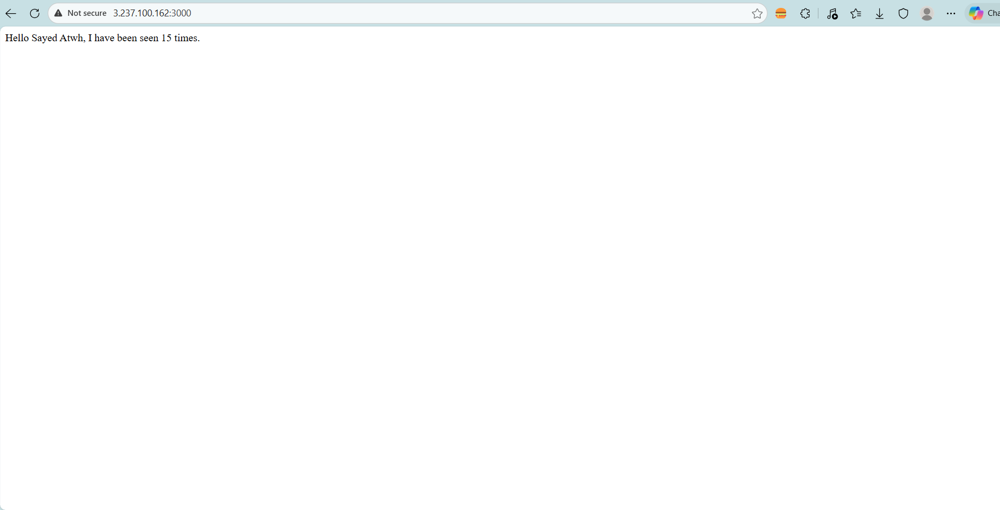  

Flask web application displayed correctly in the browser.

---

✅ Result

A Python Flask web application was successfully deployed inside a Docker container and accessed through a web browser.
This setup demonstrates how Docker simplifies application deployment and ensures consistency across different environments.

---

👤 Author

Name : Sayed Atwh Sayed

GitHub : https://github.com/SayedAtwh/

LinkedIn : https://www.linkedin.com/in/sayed-atwh-sayed

Email : sayed.atwh.sayed@gmail.com

---

📜 License

This project is licensed under the MIT License - see the LICENSE file for details.
